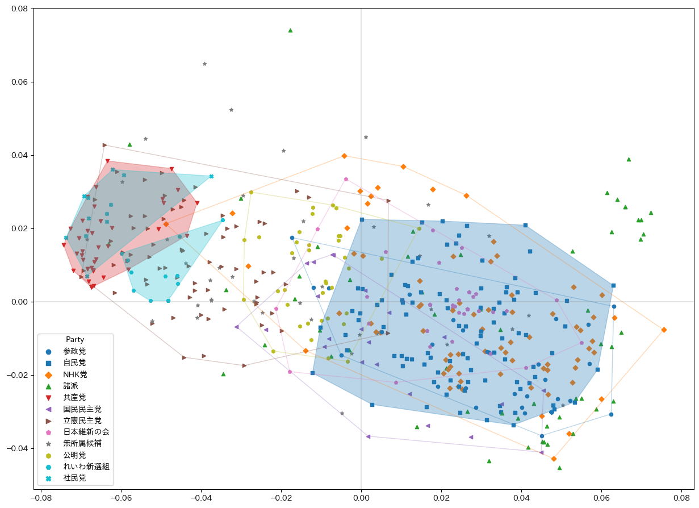
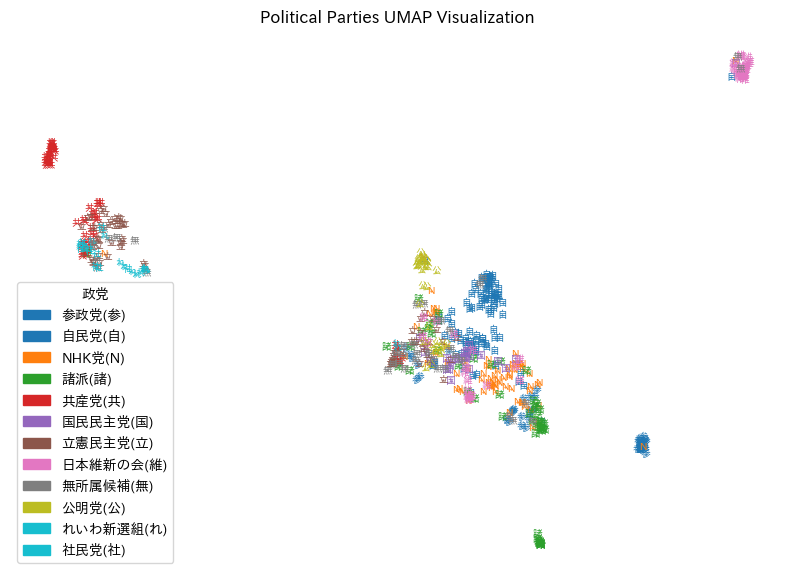
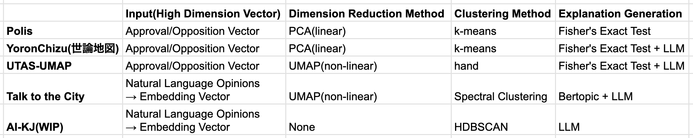

# UTAS-Polis / UTAS-UMAP

This project attempts to visualize and analyze the opinion space using data collected from over 600 Japanese Diet members in the 2022 House of Representatives election, as provided by the UTAS dataset, employing methods such as Polis and UMAP.

## About UTAS  
UTAS (University of Tokyo Taniguchi Lab - Asahi Survey) is a dataset compiled by the University of Tokyo’s Taniguchi Laboratory and the Asahi Shimbun, including survey results from both politicians and voters during Japanese House of Representatives and House of Councillors elections since 2003. For more details, please see the [UTAS website](https://www.masaki.j.u-tokyo.ac.jp/utas/utasindex.html).

## About Polis  
Polis is an open-source tool developed by [Colin Megill](https://colinmegill.com/) and others, providing a statistical approach to real-time visualization of large-group opinion distributions. In this experiment, instead of using Polis directly, we implemented the methodology in Python, referencing [IPython Notebook](https://github.com/compdemocracy/analysis-python/blob/main/notebooks/american-assembly-specific/american-assembly-representative-groups-and-comments.ipynb), to visualize the opinion space.

## About UMAP  
UMAP is a non-linear dimensionality reduction technique. Since Polis internally uses PCA, a linear dimensionality reduction method, we experimented with replacing it with a non-linear approach like UMAP to better capture the complex structure of the opinion space.

## Comparison

for YoronChizu, visit [mielka/yoronchizu2024-data](https://github.com/mielka/yoronchizu2024-data).

# 日本語(Japanese Version)

本プロジェクトは、UTASデータセットから、2022年衆院選の際に収集された、政治家600人以上の記名アンケートデータを用い、PolisやUMAPなどの手法による意見空間の可視化・分析を試みたものです。

## UTASについて
UTAS（東大谷口研・朝日調査）は、東京大学谷口研究室と朝日新聞社による調査データセットで、2003年以降の衆院選・参院選時の政治家・有権者調査結果を含んでいます。詳細は[東大谷口研・朝日調査サイト](https://www.masaki.j.u-tokyo.ac.jp/utas/utasindex.html)をご覧ください。

## Polisとは
Polisは、[Colin Megill](https://colinmegill.com/)らが開発したオープンソースツールで、大規模グループの意見分布をリアルタイムに可視化するための統計的アプローチを提供します。本実験では、Polisそのものではなく、[Colin MegillによるIPython Notebook](https://github.com/compdemocracy/analysis-python/blob/main/notebooks/american-assembly-specific/american-assembly-representative-groups-and-comments.ipynb)の内容を参考にPython上で実装し、意見空間の可視化を行いました。

## UMAPとは
UMAPは非線形次元削減の手法です。Polisは内部的に線形な次元削減手法であるPCAを使っています。ここを非線形手法に置き換えることによって、複雑な意見空間構造をよりよく把握する実験を行いました。

